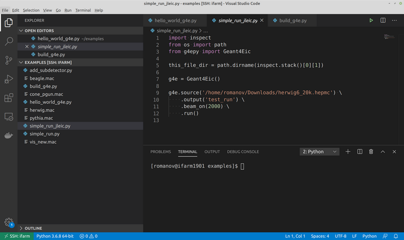
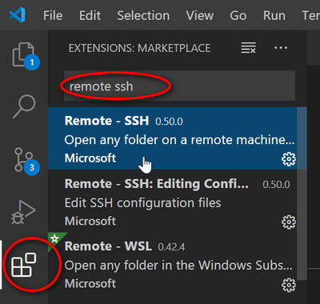

Farms
=====

Spack CVMFS central installation
--------------------------------

ESCalate framework is installed on CVMFS and can be used directly on
farms with spack

**1. Source spack environemnt**

Tcsh/csh users (default for ifarm)

::

    source /cvmfs/eic.opensciencegrid.org/packages/setup-env.csh

bash/zsh

::

    source /cvmfs/eic.opensciencegrid.org/packages/setup-env.sh

**2. Load escalate module**

::

    spack load escalate@1.1.0

It should be ready to work

**3. Test run**

::

    which g4e
    ejana

JLab IFarm
----------

Singularity installation
........................

There is no docker on IFarm, but one can use Singularity

::

    [user@ifarm1801 ~]$ module load singularity
    [user@ifarm1801 ~]$ singularity shell --cleanenv /group/eic/escalate/singularity-latest
    Singularity> source /container/app/userenv.sh 

And it is ready to go

Examples
........

**1. Simple way to smear a file**

::

    smear /path/to/file.txt

Here are 2 more advanced examples files for fast and full simulation.
Please run them in your work directory.

**Fast simulation (eic-smear):**

.. code:: python

    from pyjano.jana import Jana

    Jana().plugin('beagle_reader')\
          .plugin('open_charm')\
          .plugin('eic_smear', detector='jleic')\
          .plugin('jana', nevents=20000, output='hepmc_sm.root')\
          .source('/group/eic/mc/BEAGLE/eD_5x50_Q2_1_10_y_0.01_0.95_tau_7_noquench_kt=ptfrag=0.32_Shd1_ShdFac=1.32_Jpsidifflept_test40k_fixpf_crang.txt')\
          .run()

**Full simulation:**

.. code:: python

    from g4epy import Geant4Eic
    g4e = Geant4Eic()\
          .source('/group/eic/mc/BEAGLE/eD_5x50_Q2_1_10_y_0.01_0.95_tau_7_noquench_kt=ptfrag=0.32_Shd1_ShdFac=1.32_Jpsidifflept_test40k_fixpf_crang.txt')\
          .output('hello')\
          .beam_on(200)\
          .run()

Look at the docker or `tutorials
repo <https://gitlab.com/eic/escalate/workspace>`__ for more examples

Convenient work on IFarm from home
..................................

Since many of us experience COVID-19 related teleworking from home, here
is a suggestion of a very convenient workflow - vscode + remote ssh.

It allows to work with remote ssh scripts and code (and have unlimited
consoles) like they are on your home computer. Here is how it looks
like:

How to set it up:
^^^^^^^^^^^^^^^^^

-  install vscode https://code.visualstudio.com/
-  open it and install remote ssh plugin. Here is where it is:
    |image0|
-  then here is a short and good tutorial, how to use it:
   https://code.visualstudio.com/remote-tutorials/ssh/getting-started
-  edit config file (see below)
-  after you connect, open folder (or whatever), you'll see, you are on
   ifarm

The trick with ifarm is that you first have to do proxy jump through
``login.jlab.org``. To solve this automaticaly edit ssh settings which
usually are located in ``~/.ssh/config`` folder

(To do this vscode press F1 and type in ``remote ssh config``)

::

    Host jlogin
        User romanov
        HostName login.jlab.org
        Port 22

    Host ifarm
        User romanov
        HostName ifarm
        Port 22
        ProxyJump jlogin

If on windows you have it is because windows installs old ssh. Fix is to
add one more line to the config

::

    ProxyCommand ssh -W %h:%p ifarm

Now you can also connect to ifarm like ``ssh ifarm`` and use it in
vscode.

    CONCERNED with MISCROSOFT word? Use
    `vscodium <https://github.com/VSCodium/vscodium>`__. ``vscodium``
    relates to ``vscode`` the same way as ``Chromium`` browser relates
    to ``Google Chrome``

