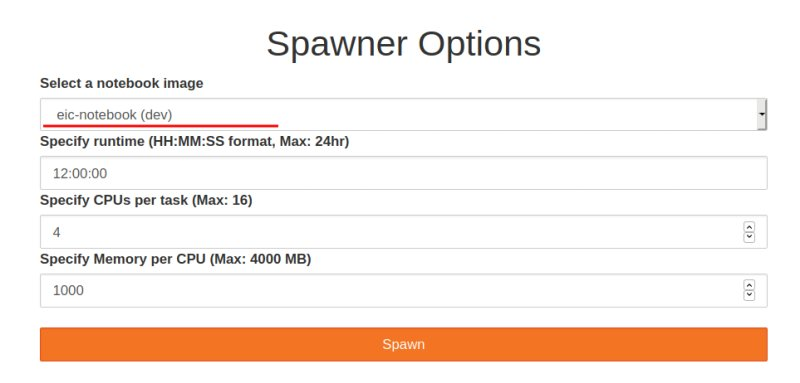

Jupyter-hub
===========

::

    http://jupyterhub.jlab.org

Escalate framework image added to Jefferson Lab Jupyter Hub! It is still
in beta stage, several features are not yet working (and we are working
on them). Someting works differently compared to when you run the image
in docker. This page describe this.

Go to `jupyterhub.jlab.org <http://jupyterhub.jlab.org>`_ (follow
authentication instructions if you are using it for the first time)

In the **Spawner options** -> **Select a notebook image**, set
**eic-notebook (dev)** there

   jlab\_jupyterhub\_spawner

You should end up in your jefferson lab home directory.

Differences with running in docker
----------------------------------

When you run in docker you start as *eicuser* with user-ID=1000. On
JupyterHUB you run in your JLab home directory with your CUE user (and
your CUE user-ID). This implies that:

1. Your JLab home dir .bashrc is being called instead of one in docker.
   If you set custom python version or compiler in your .bashrc it will
   interfere with what is used in docker (will not work most of the
   time).

2. Since you start in your CUE home dir, you don't have the examples and
   tutorials. Just clone them to your JLab home dir:
   ``bash     git lfs clone https://gitlab.com/eic/escalate/workspace.git   # 'lfs' is to pull data files!``

3. All docker contents are readonly. One can't run ``sudo`` to elevate
   privilegies and change something in the container. Which means that
   you can't change eJana or G4E inside the docker, but you can install
   them in your home directory and `setup ejpm to use
   them <https://gitlab.com/eic/escalate/ejpm>`__.

What is not working
-------------------

1. Inspecting root files by ckicking on them. Solution - use uproot to
   explore the files.

